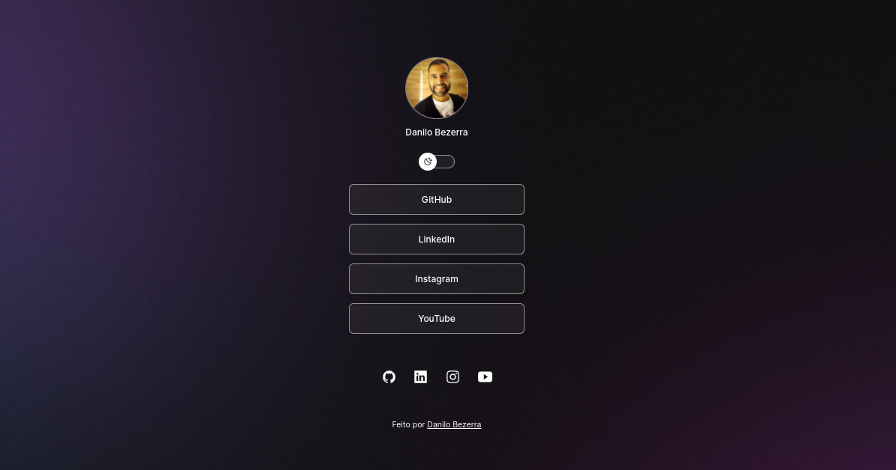

<h1 align="center"> MY DEV LINKS </h1>

Página dos meus links pessoais e de trabalho.

  <a href="#-tecnologias">Tecnologias</a>&nbsp;&nbsp;&nbsp;|&nbsp;&nbsp;&nbsp;
  <a href="#-projeto">Projeto</a>&nbsp;&nbsp;&nbsp;|&nbsp;&nbsp;&nbsp;
  <a href="#-layout">Layout</a>&nbsp;&nbsp;&nbsp;|&nbsp;&nbsp;&nbsp;
  <a href="#memo-licença">Licença</a>

  

 

  

## 🚀 Tecnologias

Esse projeto foi desenvolvido com as seguintes tecnologias:

- HTML e CSS
- JavaScript
- Git e Github

## 💻 Projeto

O My Dev Links é uma aplicação web onde disponibilizo os meus principais links: GitHub, LinkedIn, Instagram e YouTube.

## 🔖 Layout

Você pode visualizar o layout do projeto através [DESSE LINK](https://danilodev07.github.io/mydevlinks/).

## :memo: Licença

Esse projeto está sob a licença MIT.

---

Feito com ♥ by Danilo Bezerra :wave: [Participe da nossa comunidade!](https://discord.gg/rocketseat)
